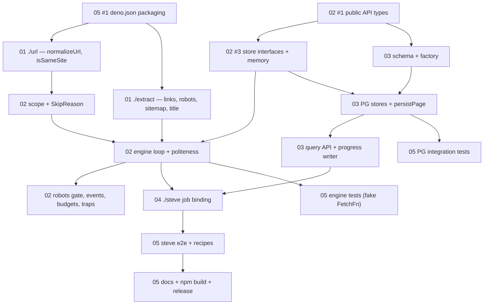

<!--
GENERATED ANALYSIS — @marianmeres/crawler implementation plan
Produced 2026-08-24 by multi-agent research -> adversarial verify -> synthesize.
Claims verified against ecosystem package working trees (page-fetcher v0.4.0, steve v3.0.0,
cron v3.2.0, clog v3.21.0). The crawler repo itself is a pre-first-commit scaffold.
Planning artifact; no code was changed.
-->

# @marianmeres/crawler — Implementation Plan Overview & Roadmap

> A new ecosystem package: given seed URLs, discover and traverse pages politely and
> resumably on top of `@marianmeres/page-fetcher`, stream back structured page results
> plus the link graph, and (opt-in) persist everything — including raw bodies — to
> PostgreSQL, with crawls runnable as `@marianmeres/steve` jobs.
>
> The architecture is layered by owner decision: the core engine is store-agnostic with
> in-memory stores as the default; `./pg` adds the PostgreSQL persistence (latest-per-URL
> body archive + per-run reporting tables, tenant-scoped cron-3.x style); `./steve` binds
> ONE CRAWL = ONE JOB. Per-URL "what fetched / what failed" reporting comes from the
> crawler's own tables, not steve's — verified against steve's source: it has no mid-run
> progress API, and its default reaper would expire any job running longer than 5 minutes.
>
> The design sketch (`tmp/crawler-DESIGN.md`) survives review largely intact, with these
> load-bearing corrections: its "default: page-fetcher browser stack" is impossible
> (browser drivers are injected, never dependencies — default is the HTTP adapter);
> `checkpoint()`/`checkpointEvery` is dropped (resume is a property of persistent stores);
> SQLite is dropped (PG only); a first-class injectable `logger?: Logger` (clog) is added
> everywhere; the cumulative byte budget is renamed `maxTotalBytes`.
>
> Read order: this file, then `01`…`05` as needed. `PROGRESS.md` tracks execution.

## Top recommendations across all dimensions (ranked)

| Rank | Work item | Doc | Value | Effort | Risk | Why now |
|------|-----------|-----|-------|--------|------|---------|
| 1 | `normalizeUrl` pipeline + `NormalizeOptions` | [01](./01-url-and-extraction.md) #3 | high | M | med | Normalization defines dedup — everything downstream inherits its semantics; the sketch itself orders it first |
| 2 | `isSameSite` + registrable-domain heuristic + `classifyLink` | [01](./01-url-and-extraction.md) #1 | high | S | med | Scope evaluation needs it; small and closes the PSL judgment call (heuristic + injectable override) |
| 3 | Unit-test corpora (idempotency property test, fixtures) | [01](./01-url-and-extraction.md) #5 | high | M | low | Locks the normalize/extract semantics in place before anything builds on them |
| 4 | Public API surface (`crawl`, `createCrawler`, all types) | [02](./02-crawl-engine.md) #1 | high | M | low | The contract every other doc consumes; includes the backbone corrections (logger, fetcher default, no checkpoint) |
| 5 | deno.json: exports map, imports, publish exclude | [05](./05-testing-docs-release.md) #1 | high | S | low | The scaffold ships broken as-is (no publish exclude, single-string exports); mechanical and unblocks all submodules |
| 6 | `extractLinks` tolerant tokenizer + `extractTitle` | [01](./01-url-and-extraction.md) #6 | high | L | med | Largest greenfield piece; single-pass no-DOM scanner shared by meta-robots/title extraction |
| 7 | `parseRobotsTxt` + wildcard matcher | [01](./01-url-and-extraction.md) #4 | high | M | med | Pure parser with RFC-9309 longest-match semantics; enforcement lives in the engine |
| 8 | `parseMetaRobots` + `parseXRobotsTag` | [01](./01-url-and-extraction.md) #2 | high | S | low | Small; reuses the shared scanner |
| 9 | Scope evaluation, `SkipReason`, private-host guard | [02](./02-crawl-engine.md) #2 | high | M | low | Pure pipeline with pinned check order; every non-followed link gets a recorded reason |
| 10 | `FrontierStore`/`VisitedStore` interfaces + memory impls | [02](./02-crawl-engine.md) #3 | high | M | med | The claim/ack `pop({excludeHosts})` contract is what lets PG SKIP LOCKED stores drop in without engine changes |
| 11 | Worker pool, politeness scheduling, streaming `run()` | [02](./02-crawl-engine.md) #5 | high | L | med | The engine heart: global+per-host caps, ready-times, bounded-channel backpressure, cancellation |
| 12 | robots.txt enforcement gate | [02](./02-crawl-engine.md) #4 | high | M | med | Per-origin cached gate over the doc-01 parser; 4xx=allow / 5xx=disallow, Crawl-delay into the scheduler |
| 13 | Fake-`FetchFn` helper + fixture mini-site + engine tests | [05](./05-testing-docs-release.md) #3 | high | M | med | Zero-network engine testing; needed the moment the engine exists |
| 14 | PG schema DDL + `createCrawlerPg` factory | [03](./03-pg-persistence.md) #3–4 | high | M | med | cron-3.x-style tenant-scoped tables incl. the latest-per-URL body archive; steve/cron injection conventions copied exactly |
| 15 | `PgFrontierStore`/`PgVisitedStore` + `persistPage` writers | [03](./03-pg-persistence.md) #5–6 | high | M | med | SKIP LOCKED pop, ON CONFLICT dedup, one idempotent transaction per completed page (batch weighed and declined for v1) |
| 16 | Consumer query/reporting API + live progress writer | [03](./03-pg-persistence.md) #7, #1 | high | M | low | The owner's per-URL reporting requirement: `listPages`/`listFailed`/`brokenLinks`/`listChanged`/`getBody` + throttled stats JSONB |
| 17 | `./steve` binding: handler factory, resume, guidance | [04](./04-steve-jobs-integration.md) #1–7 | high | M | med | One crawl = one job keyed by `job.uid`; crash-resume from PG state; LOUD reaper/claiming caveats verified in steve source |
| 18 | Docs set (README, AGENTS.md), npm build deps, release | [05](./05-testing-docs-release.md) #5, #2, #8 | high | M | med | `versionizeDeps([""])` currently ships zero runtime deps to npm — must be fixed before first publish |

Deliberately deferred as lower-value: `parseSitemap` (01#7, med — needed for sitemap
seeding but not for the core loop), trap detection (02#8, med — required before real-site
use, not before the engine exists), events/stats + budgets polish (02#6–7), steve e2e +
recipes (05#7, #9). All tracked in `PROGRESS.md`; nothing was dropped.

## Recommended first sprint (do these 5 first)

1. **`normalizeUrl` + `NormalizeOptions`** ([01](./01-url-and-extraction.md) #3) — the
   sketch is explicit that everything depends on its semantics; the 11-step toggleable
   pipeline with the written idempotency proof is the package's correctness core.
2. **`isSameSite` + heuristic + `classifyLink`** ([01](./01-url-and-extraction.md) #1) —
   completes the `./url` submodule; closes the PSL question with the heuristic +
   injectable override.
3. **Unit-test corpora for `./url`** ([01](./01-url-and-extraction.md) #5, url part) —
   table-driven normalize cases + the seeded-PRNG idempotency property test the sketch
   requires; extract fixtures land with item 6 later.
4. **Public API types** ([02](./02-crawl-engine.md) #1) — pure contract work; unblocks
   docs 03/04/05 which all consume the shapes.
5. **deno.json packaging fix** ([05](./05-testing-docs-release.md) #1) — exports map,
   imports, the missing publish-exclude block; mechanical, prevents an embarrassing
   first publish.

## Cross-cutting themes

- **Reuse boundary is verified, not aspirational.** page-fetcher demonstrably owns
  retries, timeouts/deadlines, redirects+`finalUrl`, byte caps, charset, conditional
  requests, circuit breaking, browser lifecycle; steve owns job lifecycle/retry; the
  crawler must not reimplement any of it. The retry-layering rule (page-fetcher retries
  transport, crawler never retries pages, steve retries whole-crawl on crash) appears in
  docs 02, 04, and 05's README item.
- **The ecosystem gap is real:** nothing existing provides URL normalization, link
  extraction, robots/sitemap parsing — `./url` and `./extract` are greenfield by
  necessity and therefore standalone/zero-dep by design (nettle-crawler's cheerio-based
  utilities are prior art to consult, not copy).
- **One claim/ack store contract carries both modes.** `pop({excludeHosts})` + `ack`/
  `release` + boolean `push` (doc 02) maps 1:1 onto memory structures and onto
  `FOR UPDATE SKIP LOCKED` (doc 03, modeled on steve's `_claim-next.ts`).
- **Job-mode observability is a crawler-owned concern.** Steve verifiably has no mid-run
  progress API; the throttled `__crawler_crawl.stats` writer (03#1) is the single live
  signal, and `jobs.find(uid)` answers only "is it running".
- **JSON-serializability is a recurring seam:** job payloads (04#1 strips functions,
  RegExp, collect), `onPage` returns (03#6 guarded stringify), progress snapshots (02#6).

## Dependency / sequencing notes

## Completeness check

Cross-doc reconciliation performed during synthesis (all applied to the doc files):
- Doc 02 adopted doc 03's `hasBody` gate: conditional recrawl headers are seeded only
  when a stored body exists (`VisitedState.hasBody`); memory stores always refetch full.
- Doc 03 gained the two primitives doc 04's binding requires: `getCrawlByJobUid()` (+
  partial index on `job_uid`) and `recomputeStats()` for crash-resume baselines.
- `extractTitle` was unowned (sketch's `PageResult.title` had no source); doc 01 item 6
  now specs it on the shared scanner.
- Non-JSON-serializable `onPage` returns: doc 03 item 6 pins store-NULL-and-warn.
- deno.json exports-map ownership settled on doc 05 (docs 01/02/03 all defer).
- `persistBody` ownership settled: a `CrawlerPgOptions` concern; doc 04 routes the
  job-payload boolean to the `./pg` factory, never through `CrawlOptions`.
- Doc 04's verifier strengthened the reaper formula: steve preserves `started_at` across
  retries, so `maxAllowedRunDurationMinutes` must cover ALL attempts + backoff, not one.

Remaining open questions needing the owner's call are listed per doc and collected in
`PROGRESS.md`; none blocks the first sprint.

Source documents: [`01-url-and-extraction.md`](./01-url-and-extraction.md),
[`02-crawl-engine.md`](./02-crawl-engine.md),
[`03-pg-persistence.md`](./03-pg-persistence.md),
[`04-steve-jobs-integration.md`](./04-steve-jobs-integration.md),
[`05-testing-docs-release.md`](./05-testing-docs-release.md).
