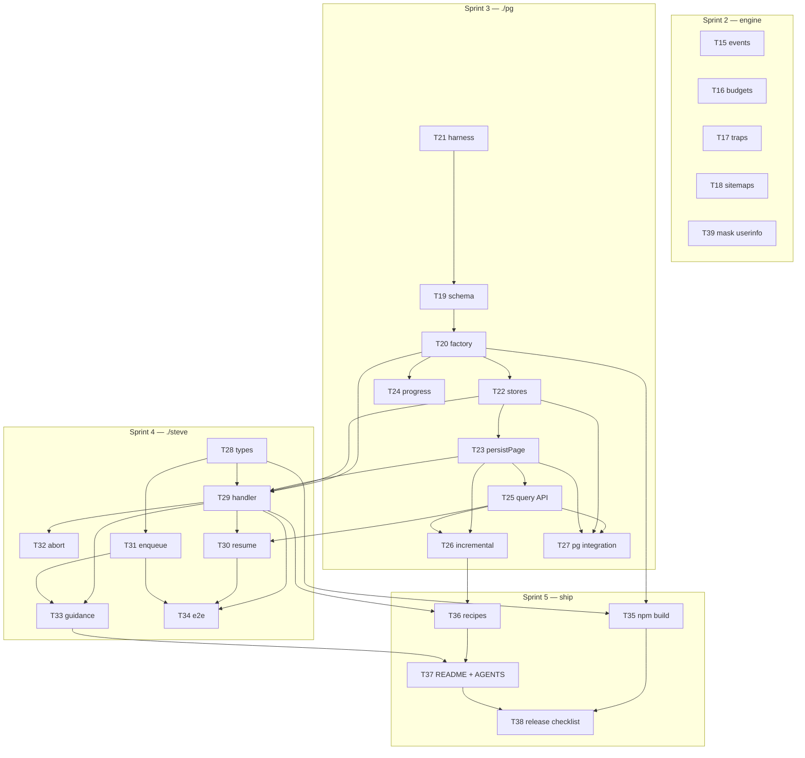

<!--
GENERATED PLAN — @marianmeres/crawler, remaining v1 work (docs/plan backlog ranks 15-38)
Produced 2026-08-25 by re-cutting docs/plan/PROGRESS.md's open backlog into the current
MULTISTEP_PROGRESS_FILESYSTEM_LAYOUT_INSTRUCTIONS.md + sprint/SPEC.md tracker format.
Claims re-verified against the working tree at commit cebf5d0. No code was changed.
-->

# @marianmeres/crawler — remaining v1 work

> The package is roughly half built. `./url`, `./extract`, `./stores` and the crawl
> engine are done and tested (193 tests green at `cebf5d0`): normalization, link and
> robots extraction, scope evaluation, the memory stores, the worker pool with per-host
> politeness, the streaming `run()`, and the robots gate. What remains is everything
> that turns a working engine into a shippable package.
>
> The remaining work splits cleanly into four sprints, and the split is a dependency
> fact rather than a preference: the engine's inert options (**events, budgets, traps,
> sitemaps**) depend on nothing; `./pg` depends on itself in a strict chain; `./steve`
> depends on `./pg` existing, because job mode's retry-resume has nowhere else to resume
> from; and packaging, recipes and the README depend on the whole API being real.
>
> Two things are worth knowing before starting. First, most of sprint 2 is **wiring
> options that already exist**: `CrawlEvents`, the three budgets and `TrapOptions` are
> all declared in `src/types.ts`, validated in `src/options.ts` and pinned by
> `tests/options.test.ts` — and read by nothing. Do not redesign them. Second, the whole
> `./pg` sprint is untestable without a live PostgreSQL, and its tests are `ignore`-gated
> on `TEST_PG_*`, so a sprint run against no database would report nine green tasks that
> never executed a statement. Every PG task's **Done when** is written to make that
> visible.
>
> This directory re-cuts the still-open half of
> [`../plan/PROGRESS.md`](../plan/PROGRESS.md) into the current tracker format. The deep
> specs stay where they are — `../plan/01-…` through `../plan/05-…` are unchanged and
> still authoritative; the docs here add what that format requires and those docs lack:
> a **Done when** per task, an explicit affected-file list, the dependency graph, and the
> decisions taken on 2026-08-25 to close the open questions.

## The remaining scope, in execution order

Deviation from the convention's "12-18 rows": this is a completion plan, so the table is
the **whole** remaining scope rather than a selection from a larger findings list.
Ranking lives in the row order — it is the order the sprints run in.

| Sprint | ID | Task | Doc | Value | Effort | Risk |
|--------|----|------|-----|-------|--------|------|
| 2 | T15 | Events, `safeEmit`, throttled progress | [01](./01-engine-completion.md) | med | S | low |
| 2 | T16 | Budgets + `stoppedBy` | [01](./01-engine-completion.md) | med | S | low |
| 2 | T17 | Trap detection | [01](./01-engine-completion.md) | med | M | med |
| 2 | T18 | `parseSitemap` + robots `Sitemap:` seeding | [01](./01-engine-completion.md) | med | M | low |
| 2 | T39 | Mask userinfo credentials in every message | [01](./01-engine-completion.md) | med | S | low |
| 3 | T21 | PG test harness | [02](./02-pg-persistence.md) | high | S | low |
| 3 | T19 | Schema DDL — the 5 tables | [02](./02-pg-persistence.md) | high | M | med |
| 3 | T20 | `createCrawlerPg` factory + lifecycle | [02](./02-pg-persistence.md) | high | M | low |
| 3 | T22 | `PgFrontierStore` / `PgVisitedStore` | [02](./02-pg-persistence.md) | high | M | med |
| 3 | T23 | `persistPage` writers | [02](./02-pg-persistence.md) | high | M | med |
| 3 | T24 | Live progress writer | [02](./02-pg-persistence.md) | high | S | low |
| 3 | T25 | Consumer query / reporting API | [02](./02-pg-persistence.md) | high | M | low |
| 3 | T26 | Incremental re-crawl (validators, 304) | [02](./02-pg-persistence.md) | high | M | med |
| 3 | T27 | PG integration tests | [02](./02-pg-persistence.md) | high | M | low |
| 4 | T28 | `./steve` scaffold + payload/result types | [03](./03-job-mode.md) | high | S | low |
| 4 | T29 | `createCrawlJobHandler` factory | [03](./03-job-mode.md) | high | M | med |
| 4 | T32 | AbortSignal wiring | [03](./03-job-mode.md) | high | S | med |
| 4 | T30 | Failure semantics + crash-resume | [03](./03-job-mode.md) | high | M | med |
| 4 | T31 | Enqueue + status helpers | [03](./03-job-mode.md) | high | S | low |
| 4 | T33 | Reaper / claiming / listing guidance | [03](./03-job-mode.md) | high | S | low |
| 4 | T34 | Steve integration tests + e2e | [03](./03-job-mode.md) | high | M | low |
| 5 | T35 | npm build: entry points + real deps | [04](./04-packaging-docs-release.md) | high | S | med |
| 5 | T36 | Recipes / examples dir | [04](./04-packaging-docs-release.md) | med | M | low |
| 5 | T37 | README + AGENTS.md + `.env.example` | [04](./04-packaging-docs-release.md) | high | M | low |
| 5 | T38 | Release checklist + dry runs | [04](./04-packaging-docs-release.md) | med | S | low |

Ids are the ones the original backlog assigned (ranks 15-38 became T15-T38) so that every
"(task 19)" reference in the old decisions log still resolves. `T39` is new — see below.

## The next sprint (sprint 2 — engine completion)

Five tasks, no external dependencies, no database, no new submodule: everything happens
inside `src/engine/` and `src/extract/` against the fake transport that task 13 built.
It is the cheapest sprint to run unattended and the right one to rehearse the driver on.

- **T15 events** unblocks nothing structurally but makes every later sprint observable,
  and T24 writes exactly the snapshot it emits into a JSONB column.
- **T16 budgets** is the one users notice first: without it `maxPages` is silently
  ignored, which is worse than not offering it.
- **T17 traps** is the difference between "crawls a site" and "survives a calendar".
- **T18 sitemaps** closes the door task 14 deliberately left ajar (`robots.sitemaps:
  true` currently warns and seeds nothing).
- **T39** is not from the original backlog. It exists because the 2026-08-25 credentials
  decision (keep userinfo verbatim in the data) needs its counterpart — credentials must
  never reach a log line — and that is real work rather than a footnote on someone else's
  task.

## Cross-cutting themes

**Declared-but-inert options are this codebase's characteristic debt.** Three of sprint
2's five tasks are wiring something the type system already promises. The pattern is
benign as long as it is closed promptly; the danger is a `CrawlOptions` field that has
been documented for months and does nothing.

**Every foreign contract is copied, not shared.** `tests/_pg.ts` and
`with-transaction.ts` are vendored from steve verbatim (the ecosystem precedent — cron
does the same); `pg` and steve are type-only imports; browser drivers are injected.
Both files are inlined in the task docs so no sprint task needs to read another
repository.

**Silence is the enemy in three separate places** and each has a task that closes it: a
PG suite that skips instead of running (T21/T27's Done when), a steve worker that
noop-completes a crawl job it cannot handle (T33), and a reaped job that looks like a
finished one (T33, T30).

**Idempotence is the design, not an optimization.** `persistPage` replays cleanly, the
frontier's `ON CONFLICT` is the dedup, `openCrawl` re-claims orphans — which is the only
reason steve's retry-the-whole-job model is safe.

## Dependency / sequencing

Every edge above is mirrored in `PROGRESS.md`'s `Deps` column, which is the copy a driver
reads. Note that the driver in this ecosystem does not yet gate on `Deps` — document
order does that job today, and the row order in each sprint table is a valid topological
order.

## Completeness check

- **The 304 traversal gap is the one thing no source-doc item owned.** Doc 03 §8 assigns
  "engine-side seeding hooks" to "doc 02/04 wiring", and neither doc 02 nor doc 04 has an
  item for it. Verified in the tree: `#conditionalHeaders()` exists and works, but a 304
  arrives with no body and `dispatcher.ts:644` extracts links only when there is one — so
  an incremental re-crawl would traverse nothing. T26 now owns it explicitly, including
  the one interface addition it needs (`VisitedStore.getBody?`).
- **`tests/crawler-limits.test.ts` and `tests/crawler-events.test.ts`** were deferred by
  task 13 to the ranks that make them writable; they are folded into T16 and T15 rather
  than left as free-floating test debt.
- **Nothing here re-opens a settled decision.** The 2026-08-25 additions in
  `PROGRESS.md`'s Decisions log close the eight questions the old tracker carried; four
  were the owner's call and four were engineering calls made here with the rationale
  recorded.
- **Deliberately out of scope for v1:** `mcp.ts` MCP tools (noted in T38), cross-tenant
  body deduplication (decided against), a `resumeCrawlJob()` helper (decided against),
  batched PG writes (doc 03 weighed and declined), and the actual publish, which is a
  human step outside the tracker.

Source documents: [`../plan/01-url-and-extraction.md`](../plan/01-url-and-extraction.md),
[`02`](../plan/02-crawl-engine.md), [`03`](../plan/03-pg-persistence.md),
[`04`](../plan/04-steve-jobs-integration.md),
[`05`](../plan/05-testing-docs-release.md).
